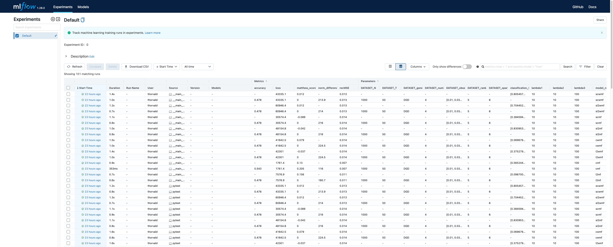

# Welcome to Decipher

Decipher is a collection of tools produced by Simula Consulting as an end product from the Decipher project.

!!! Warning
    
    Decipher is currently under development.
    Major changes in design and functioality is to be expected!

??? note "Ownership"
    The code product is originally written by Severin Langberg!

## Overview
Decipher currently consist of two main models

 - [MatFact](matfact.md)
 - [HMM (Hidden Markov Model)](hmm.md)

 The goal of Decipher is to offer a simple unified API to all models, for training and testing.

```python
# Ideal future usage

from matfact import matfact
from hmm_synthetic import hmm

for model in (matfact, hmm):  # (1)!
    model().fit(some_data)
```

1.  :sweat_smile: Right now, fit of HMM is not implemented.

### MLFlow logging
We use MLFlow for tracking experiments.
See their [tracking docs](https://mlflow.org/docs/latest/tracking.html) for details.



However, we also have added some convenience wrappers around MLFlow.
Instead of `mlflow.start_run`, use [`MLFlowLogger`][matfact.model.logging.MLFlowLogger].


### Visualization
We have also made a simple pilot for interactive data visualization.

<video controls src="static/MVP_multimodel.mp4"></video>

## Discussion of models
The purpose of the project is to personalize cerivcal cancer screening.
There are however many approaches to this, and models for several different tasks have been developed.

### The datasets
First, let us mention the data we have available:

**Data screening results**

:   Discrete time series of measurement results from screening exams.
    The time series is /very/ sparse, with one measurement about every three years. 
    The measurement result is one of four severity levels:

    1\. Normal 

    2\. Low-risk

    3\. High-risk

    4\. Cancer

    We typically represent the time series as a $(N \times T)$ array, where $N$ is the number of individuals and $T$ the number of time steps.

    !!! info
        The majority of the code developed so far, is solely concerned with this type of data.

    ??? abstract "Details on the four risk levels"
        The clinical exam results in one of many (> 10 ) diagnoses, several of which are overlapping in severity.
        These are then mapped onto one of the four severity levels.
        The number four was chosen as a compromise between having sufficient resolution while still getting enough samples from each state.
        Some discussion on this can be found in [the HMM paper](https://onlinelibrary.wiley.com/doi/epdf/10.1002/sim.8681) on page 6.

**HPV data**

:   Some individuals take an HPV (Human papillomavirus) test.
    For this data, we have registered when the test was taken, and its result (if and possibly which virus subtypes were found).

    This data has been used in conjuction with the screening data to learn the relative importance of the different virus types as a risk predictor.
 
**Lifestyle questionnaire**
:   Questionnaire data on lifestyle, such as number of sexual partners, age at first sexual intercourse, smoking habits, drinking habits, etc.
    

### The models

The models that have been developed/investigated is 

- [MatFact](matfact.md)

    - Trained on screening data
    - Can predict the state of an unseen history at a given time point

- [HMM (Hidden Markov Model)](hmm.md)

    - Trained on screening data
    - Can:
        - Synthezise screening data
        - Predict the state for an unseen history at a given time point

    !!! Warning "Fit not implemented"

        The fitting of the HMM is not implemented

    !!! Warning "Hidden and observed layers"

        The current HMM implementation only implements the hidden variables.
        The observation layer is not implemented, and the outputted states are simply
        the hidden states.

- HPV survival model

    - Trained on HPV and screening data.
    - Can give weights for the relative risk level of the different HPV types

- GDL (geometric deep learning)