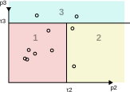

# MatFact

Matrix Factorization with temporal regularization.

!!! example
    ```python
    from matfact.model import train_and_log
    from matfact.data_generation import Dataset
    
    data = Dataset.generate()
    X_train, X_test, _, _ = data.get_split_X_M()
    
    train_and_log(X_train, X_test)
    ```

## Issues with threshold based classification

During the development of the age dependent thresholds, several issues became apparent, and these also hold for the simple constant-in-time model.

1. Matthew's correlation coefficient may not make the most sense to optimize for.

    For example, using the notation $MCC(\vec{c}, \vec{p})$, for the Matthew's correlation coefficient given a prediction $\vec{p}$ and correct state $\vec{c}$, we have
    $$
    \begin{array}{c}
    MCC([2,1], [2,2]) = 0.5\\\\
    MCC([2,1], [2,3]) = 0.0
    \end{array}
    $$
    and
    $$
    \begin{array}{rl}
    MCC(\hphantom{1,}[1,1,1], \hphantom{1,\ }[1,1,1]) &= 0.0\\\\
    MCC([1,1,2,1], [1,1,2,1]) &= 1.0
    \end{array}
    $$

2. How to solve the optimization problem
   
    The issue is the most obvious in constructed test cases.
    For example, consider $\vec{p} = (0.99, 0.01)$ and that the correct class is the latter.
    This means that the correct threshold value is any $\tau_2 \leq 0.01$.
    However, for _any_ value above this, the prediction is wrong, with no gradient to guide the solver.
 
    The solver we use, [differential evolution](https://docs.scipy.org/doc/scipy/reference/generated/scipy.optimize.differential_evolution.html), works by sampling the solution space with some sampling strategy, compare the score at those samples, and construct a new and improved sample for the next iteration.
    However, if all samples happen to fall in a region where the score function is the same, the algorithm will assume the solution to be optimal, and terminate.
    In these constructed cases, the solution falls at the end of the domain; 
    $[0, 0.01]$ in the example above.
    The sampling algorithm currently used, [latinhypercube](https://docs.scipy.org/doc/scipy/reference/generated/scipy.stats.qmc.LatinHypercube.html#scipy.stats.qmc.LatinHypercube), will when generating $n$ points, guarantee that there is at least one within each $1/n$ partition.
    This means that to ensure one point in the solution space above, we need 100 points, which is not feasible.
 
    A solution to this problem is to use another sampling strategy, for example evenly spaced out points, including the end points 0 and 1.
    However, it is not immediately clear how this affects the real higher dimensioned cases;
    it is not a good approach to impede the real cases we want to solve for the case of tests.

    Another approach, leverages the fact that we know that the only interesting 'change points' for the thresholds are at the probabilities observed for that class.
    There is no point in trying two thresholds not separated by a probability, as they will certainly produce the same prediction.
    Therefore, an exhaustive search is to test all combinations of threhsolds where the thresholds are drawn from the observed probabilities;
    as an initialization strategy we may instead draw samples from that exhaustive search, thus garantueeing that we only test thresholds with a hope of generating a different prediction.

For now we continue using the differential evolution solver, with two initialization strategies implemented:
the default _latinhypercube_ and a custom that samples from the above mentioned exhaustive search.
In the future, however, we could consider finding/implementing a better solver if we find that to important.
Looking at the note and figure below, it is obvious that when moving a threshold, we need only recompute the points that the threshold line moves past, which could be utilized in a more optimal solver.

???+ Note "How the thresholds work"

    The thresholds are shown pictorally in the figure below.
    For all probabilities $p_i, i > 1$ (recall state labels are 1-indexed), we find thresholds $\tau_i$.
    We select the state witht the highest label number for which $p_i \geq \tau_i$.
    The thresholds effectively divide our $p$ space into hypercubes that define which predictions to classify as which state.

    

## Reference

::: matfact.model.matfact
    options:
      show_root_heading: true

::: matfact.model.config
    options:
      members: [ModelConfig]
      show_root_heading: true

::: matfact.model
    options:
      members: 
        - train_and_log
      show_root_heading: true
      separate_signature: true

::: matfact.model.factorization
    options:
      show_root_heading: true
      filters:
        - "!loss()$"
        - "!run_step()"
        - "!^_"

::: matfact.model.factorization.convergence

::: matfact.model.logging
    options:
      show_root_heading: true
      filters:
        - "!MLFlowRunHierarchyException"
        - "!^_"

::: matfact.data_generation.Dataset
    options:
      show_root_heading: true

::: matfact.model.predict.dataset_utils

::: matfact.model.predict.classification_tree