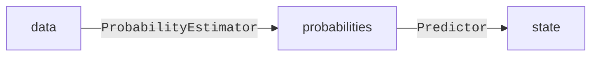

# Usage

!!! note
    These examples does not reflect what _is_ implemented, but rather serves as a specification for what we _want_ for the future.

## MatFact

Ideal usage pattern:

=== "Without logging"

    ```python
    from decipher.data import Dataset, prediction_data
    from matfact import MatFact, ModelConfig

    # Initialize model and dataset
    matfact = MatFact(ModelConfig(use_threshold_optimization=True))
    dataset = Dataset.generate()

    # Split dataset into train and test
    X_train, X_test = dataset.get_split_X()

    # Fit
    matfact.fit(X_train)  # (1)

    # Predict on masked out data
    X_test_masked, t_pred_test, x_true_test = prediction_data(X_test)
    x_prediciton_test = matfact.predict(X_test_masked)

    # Get score
    score = some_score_function(x_true_test, x_prediction_test)
    ```

    1. In fit, several things happen.

        - A factorizer ([`BaseMF`][matfact.model.factorization.BaseMF]) is instantiated.
        - The observed matrix (`X_train`) is completed.
        - As threshold optimization is enabled, the classification thresholds are optimized.
            1. Probabilities for the different states are predicted for a masked sample of `X_train`.
        (Using [`prediction_data`][matfact.model.predict.dataset_utils.prediction_data] to mask the data and `matfact.predict_probability`).
            1. The optimal classification thresholds are solved for, and a [`ClassificationTree`][matfact.model.predict.classification_tree.ClassificationTree] with those thresholds is created.

=== "With logging"

    ```python
    from decipher.logging import MLFlowLogger
    from decipher.data import Dataset, prediction_data
    from matfact import MatFact, ModelConfig

    # Initialize model and dataset
    matfact = MatFact(ModelConfig(use_threshold_optimization=True))
    dataset = Dataset.generate()

    # Split dataset into train and test
    X_train, X_test = dataset.get_split_X()

    with MLFlowLogger() as logger:  # (1)
        # Fit
        matfact.fit(X_train)

        # Predict on masked out data
        X_test_masked, t_pred_test, x_true_test = prediction_data(X_test)
        x_prediciton_test = matfact.predict(X_test_masked)

        # Get score
        score = some_score_function(x_true_test, x_prediction_test)

        # Log
        logger(matfact.get_output_dict())
    ```

### Alternative prediction modules

MatFact is designed such that it should be simple to experiment with alternative prediction modules.
There are two stages to the prediction in matfact: generating probabilities for the classes, and choosing one class given such probabilities.
These modules are easily modified.

MatFact takes in a [predictor][matfact.model.matfact.Predictor] and [probability estimator][matfact.model.matfact.ProbabilityEstimator].



=== "Replacing the predictor"

    ```python hl_lines="7 8"
    from matfact import MatFact, ClassificationTreePredictor, ArgmaxPredictor
    from decipher.data import Dataset, prediction_data

    dataset = Dataset.generate()
    X_masked, t_pred, x_true = prediction_data(dataset.X)

    matfact_argmax = MatFact(predictor=ArgmaxPredictor())
    matfact_clf = MatFact(predictor=ClassificationTreePredictor())

    # The instances are otherwise used in the exact same way.
    matfact_argmax.fit(X_masked).predict(X_masked, t_pred)
    matfact_clf.fit(X_masked).predict(X_masked, t_pred)
    ```

=== "Using an alternative probability predictor"
    :warning: This is simply a mock demonstration, `HPVProbabilityEstimator` does not exist.

    ```python
    class HPVProbabilityEstimator:
        def predict_probability(self, matfact, observation_matrix, time_points):
            return geneous_algorithm(matfact, observation_matrix, time_points)

    MatFact(ModelConfig(), probability_estimator=HPVProbabilityEstimator())
    ```

## HMM

Usage pattern:

=== "Data synthetization"
    ```python
    from decipher.data import Dataset
    from decipher.settings import Settings
    from hmm import HMM, ModelConfig

    hmm = HMM(ModelConfig())  # Use default transition weights, so no fit needed.
    dataset = Dataset.get_from_database()
    settings = Settings()

    synthetic_data: Dataset = hmm.genereate(
        number_of_samples=settings.default_sample_number,  # Number of individuals to simulate
        time_steps=settings.default_time_steps,  # The number of time steps
        emissions=[4, 2],  # (1)
        )
    ```

    1. Two emissions, the first with four possible states the second with two.
    This may for example correspond to one four-state exam and one binary HPV exam.
    Terminology inspired by [Dynamax](https://probml.github.io/dynamax/notebooks/hmm/casino_hmm_learning.html).

=== "Prediction"
    ```python
    from decipher.data import Dataset
    from decipher.settings import Settings
    from hmm import HMM, ModelConfig

    hmm = HMM(ModelConfig())  # Use default transition weights, so no fit needed.
    dataset = Dataset.get_from_database()

    X = dataset.get_X()

    # Predict on masked out data
    X_masked, t_pred, x_true = prediction_data(X)
    x_prediction = matfact.predict(X_masked)

    # Get score
    score = some_score_function(x_true, x_prediction)
    ```
