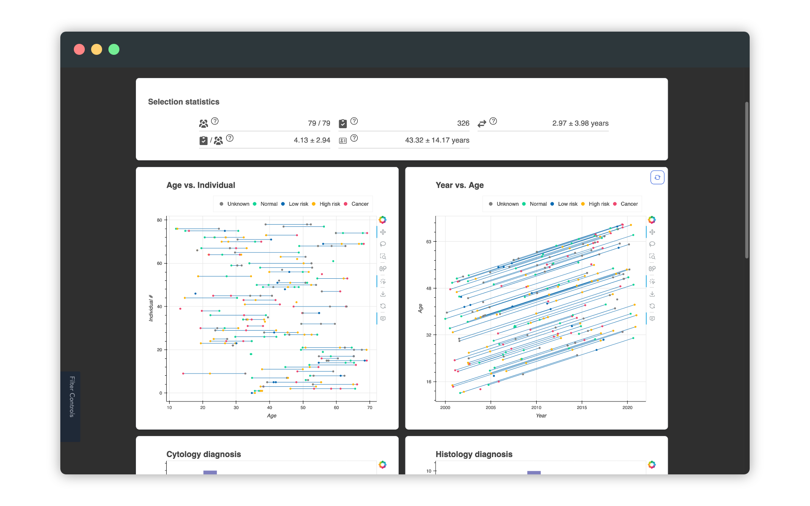

# Usage

!!! note

    This page covers only usage in the web interface!
    For information on deployment, see [the section on Docker](development.md#docker-image).

The application consists of two pages:[^1]
[^1]: Note that technically, they are two separate apps.

**The landing page**

:   Initial filtering of the dataset.
    Due to the size of the dataset, it is not feasible to plot all the data at once.
    The landing page offers high-level filters for narrowing down the data set, before moving to the actual application.

    On the default setup, the landing page is located at [http://localhost:5006/landing_page](http://localhost:5006/landing_page).

**The main page**

:   The main application page.

    

    The main application consists of four important parts

    - **The statistics panel**
        On the top, various statistics about the current selection is shown.
        Hover over the question mark to get more details.

    - **The Lexis plots**
        The two first panels display a Lexis diagram and a modified Lexis diagram, where the y axis holds the individual ID instead of the age.
        In the year vs. age pane, click the
        <svg style="width: 20px" xmlns="http://www.w3.org/2000/svg" fill="none" viewBox="0 0 24 24" stroke-width="1.5" stroke="currentColor" class="w-4 h-4"><path stroke-linecap="round" stroke-linejoin="round" d="M19.5 12c0-1.232-.046-2.453-.138-3.662a4.006 4.006 0 00-3.7-3.7 48.678 48.678 0 00-7.324 0 4.006 4.006 0 00-3.7 3.7c-.017.22-.032.441-.046.662M19.5 12l3-3m-3 3l-3-3m-12 3c0 1.232.046 2.453.138 3.662a4.006 4.006 0 003.7 3.7 48.656 48.656 0 007.324 0 4.006 4.006 0 003.7-3.7c.017-.22.032-.441.046-.662M4.5 12l3 3m-3-3l-3 3" /></svg>
        icon to swap year and age.

        Clicking on a life line or an exam marker, makes all the exams of that person selected.
        To select multiple people, either hold down shift or select the lasso tool in the right hand toolbar.

    - **The histograms**
        The histograms show information about the distribution of diagnoses and HPV test types.

        !!! warning

            The HPV test types _only_ include positive results.
            Negative and non-conclusive results are disregarded in the histogram.

    - **The filter side bar**
        On the left hand side, there is a side bar panel with filters.
        Hover over the tab to expand the filter panel.

## Diagnosis to risk mapping

All histology and cytology diagnoses are mapped to one of four risk levels,

1. Normal
2. Low-risk
3. High-risk
4. Cancer

See below for a table of the mappings.

=== "Cyt"

    | Diagnosis | Risk |
    | ----- | ----- |
    | Normal                              | Normal (1) |
    | Normal m betennelse eller blod      | Normal (1) |
    | Normal uten sylinder                | Normal (1) |
    | LSIL                                | Low-risk (2) |
    | ASC-US                              | Low-risk (2) |
    | ASC-H                               | High-risk (3) |
    | HSIL                                | High-risk (3) |
    | ACIS                                | High-risk (3) |
    | AGUS                                | High-risk (3) |
    | SCC                                 | Cancer (4) |
    | ADC                                 | Cancer (4) |
    | Metastase                           | Cancer (4) |
    | Cancer Cervix cancer andre/usp      | Cancer (4) |

=== "Hist"

    | Diagnosis | Risk |
    | ----- | ----- |
    | 10                                  | Normal (1) |
    | 100                                 | Normal (1) |
    | 1000                                | Normal (1) |
    | 8001                                | Normal (1) |
    | 74006                               | Low-risk (2) |
    | 74007                               | High-risk (3) |
    | 74009                               | High-risk (3) |
    | 80021                               | Normal (1) |
    | 80032                               | High-risk (3) |
    | 80402                               | High-risk (3) |
    | 80703                               | Cancer (4) |
    | 80833                               | Cancer (4) |
    | 81403                               | Cancer (4) |
    | 82103                               | Cancer (4) |
    | 10700                               | None |
    | 21000                               | None |
    | 79350                               | None |
    | 86666                               | None |
    | 9010                                | None |
    | 9500                                | None |
    | 99                                  | None |

=== "HPV"

    All HPV results are mapped to "Unknown"
